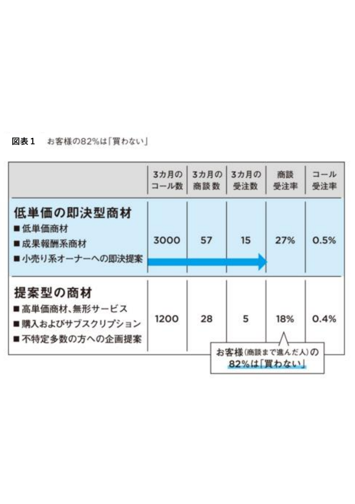
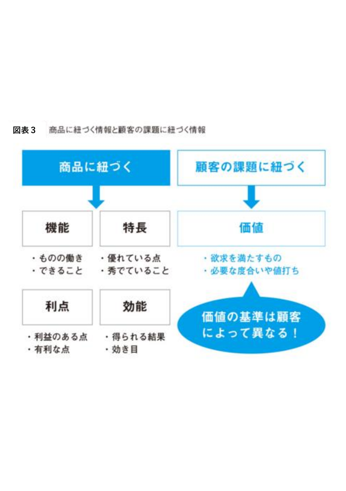
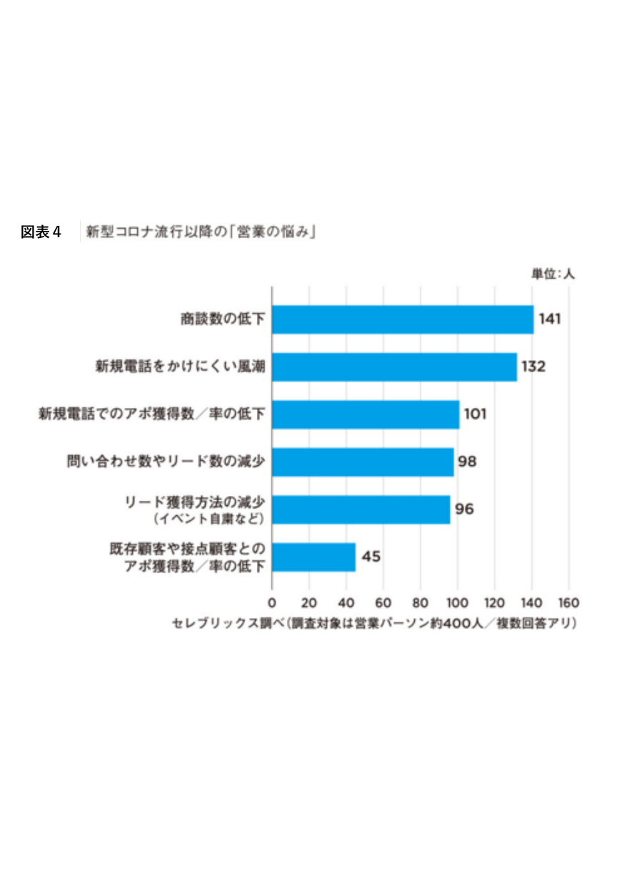
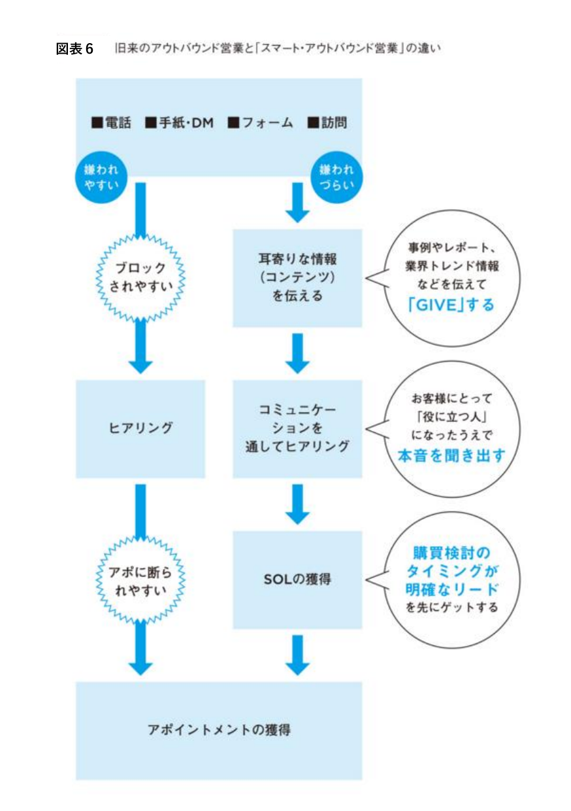
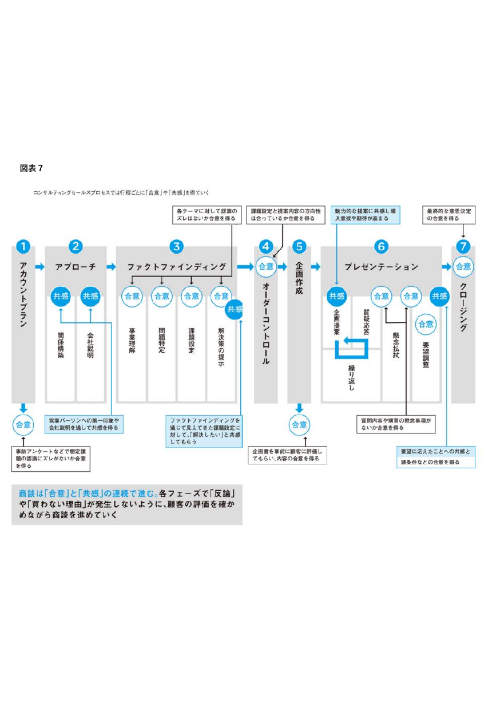
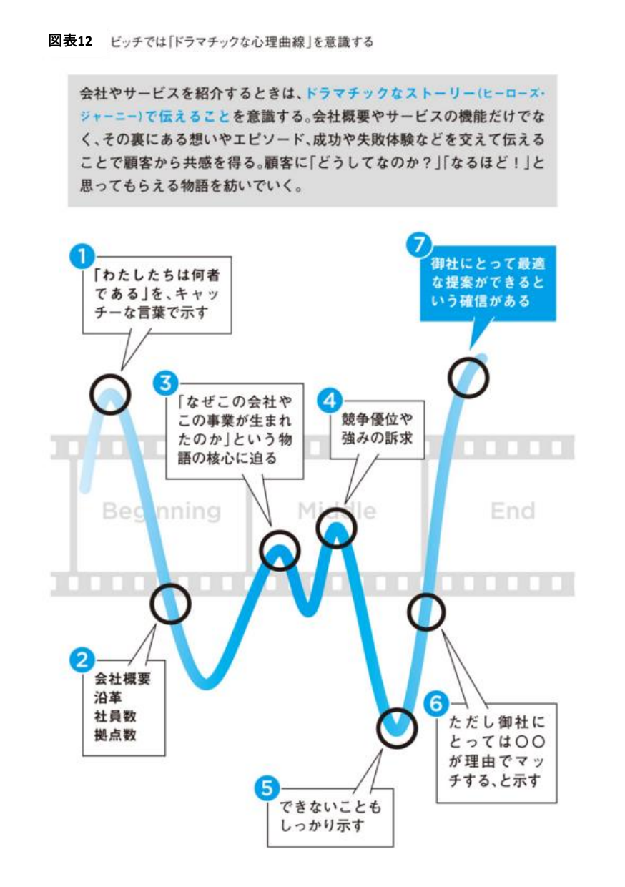
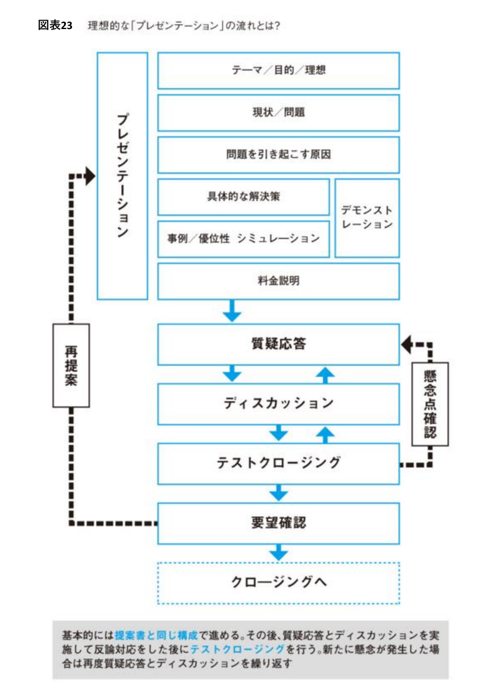

# スキル：コンサルティングセールスプロセス（アカウントプラン〜クロージング）

**使用するエージェント：** abm-strategist（プロセス設計）／ sales-enablement-executor（各工程の素材生成）
**入力：** ターゲットアカウント情報・ステークホルダーマップ・商材情報
**出力：** アカウント別セールスプロセス計画・工程別チェックポイント・プレゼンテーション構成

---

## 前提：なぜプロセス設計が必要か



低単価の即決型商材（成果報酬系・小売系オーナーへの即決提案）でも商談受注率27%、
高単価の提案型商材（無形サービス・企画提案）では商談受注率18%。
**商談まで進んだお客様の実に82%は「買わない」。**

行き当たりばったりの商談では受注できない。**工程ごとに「合意」と「共感」を積み上げるプロセス設計**が必須。

### 機能・特長ではなく「価値」を語る



| 商品に紐づく | 顧客の課題に紐づく |
|---|---|
| **機能**：ものの働き・できること | **価値**：欲求を満たすもの・必要な度合いや値打ち |
| **特長**：優れている点・秀でていること | |
| **利点**：利益のある点・有利な点 | |
| **効能**：得られる結果・効き目 | |

**価値の基準は顧客によって異なる。** 同じオフィスチェアでも「安全な品質」「デザイン賞受賞」を語るだけでは売れない。
その顧客にとって「疲れにくく生産性が上がる」ことが価値なのか、「高級感のあるオフィスになる」ことが価値なのかを見極めて訴求する。

---

## STEP 0：営業環境の変化を踏まえる（背景認識）



対面前提の営業活動は構造的に難しくなっている（商談数の低下・新規電話をかけにくい風潮・アポ獲得率の低下等）。
**「押しの強いアウトバウンド」から「GIVEを起点にしたスマート・アウトバウンド」への転換**が前提となる。



| | 旧来のアウトバウンド | スマート・アウトバウンド |
|---|---|---|
| 手法 | 電話・手紙・DM・フォーム・訪問で直接アプローチ | 耳寄りな情報（事例・レポート・業界トレンド）を先に**GIVE**する |
| 受け止められ方 | 嫌われやすい・ブロックされやすい | 嫌われづらい |
| ヒアリング | いきなりヒアリング | コミュニケーションを通して本音を聞き出す |
| 結果 | アポに断られやすい | 購買検討タイミングが明確なリード（**SOL**）を先に獲得できる |

`sales-enablement-executor.md`のコールドメール・LinkedIn DM生成時は、**GIVEが先、ヒアリングは後**の順序を必ず守る。

---

## STEP 1：コンサルティングセールスの7工程



商談は「合意」と「共感」の連続で進む。**各フェーズで「反論」や「買わない理由」が発生しないよう、
顧客の評価を確かめながら進める。**

| # | 工程 | 得るべきもの | 内容 |
|---|------|----------|------|
| ① | **アカウントプラン** | ー | ターゲットアカウントの攻略方針を事前設計 |
| ② | **アプローチ** | 共感×2 | 関係構築・会社説明を通して共感を得る |
| ③ | **ファクトファインディング** | 合意×4・共感×1 | 事業理解→問題特定→課題設定→解決策の提示。各テーマの認識ズレがないか合意を得る。課題設定と提案内容の方向性は「解決したい」と共感してもらう。**`_shared/skills/fact-finding.md`を参照し、軽量な仮説ヒアリングシートで進める（重厚な提案書は不要）** |
| ④ | **オーダーコントロール** | 合意 | 企画提案の前に、提案の方向性そのものへの合意を得る |
| ⑤ | **企画作成** | ー | 企画書を事前に顧客へ評価してもらい、内容の合意を得る |
| ⑥ | **プレゼンテーション** | 共感×2・合意×2 | 企画提案（共感）→質疑応答→懸念払拭→要望調整（合意）→最終的な意思決定の合意。**`_shared/skills/proposal-writing.md`を参照し、提案書・ROI試算書を作成する** |
| ⑦ | **クロージング** | ー | 最終合意 |

**運用ルール：**
- 各工程の「合意」「共感」を得られないまま次工程に進まない（後工程での反論・失注の温床になる）
- ④オーダーコントロールを飛ばして③から⑥へ一気に進もうとする失敗が多い。**方向性の合意を得ずに企画を作り込むと手戻りが発生する**
- `stakeholder-mapper.md`が特定したステークホルダーごとに、どの工程でどの人物の合意・共感を得るべきかを紐づける

---

## STEP 2：ドラマチックな心理曲線を意識した会社紹介



会社・サービス紹介は「機能の説明」ではなく**ヒーローズジャーニー型のストーリー**で伝える。
機能だけでなく、その裏にある想いやエピソード、成功・失敗体験を交えることで顧客の共感を得る。

```
① 「わたしたちは何者である」をキャッチーな言葉で示す
② 会社概要・沿革・社員数・拠点数（事実情報）
③ 「なぜこの会社やこの事業が生まれたのか」という物語の核心に迫る
④ 競争優位や強みの訴求
⑤ できないこともしっかり示す（信頼性の担保）
⑥ ただし御社にとっては○○が理由でマッチする、と示す
⑦ 御社にとって最適な提案ができるという確信がある、で締める
```

`_shared/skills/sales-script.md`の「物語①：個人的な物語」「物語④：製品と解決策の物語」を作る際、
このカーブに沿って山→谷→山の起伏をつけると、単なる会社概要説明より共感を得やすい。

---

## STEP 3：プレゼンテーションの理想的な流れ



基本的には**提案書と同じ構成**で進める。その後、質疑応答とディスカッションで反論対応をした上で
**テストクロージング**を行い、新たな懸念が出れば再度質疑応答とディスカッションを繰り返す。

```
プレゼンテーション本体
  テーマ/目的/理想 → 現状/問題 → 問題を引き起こす原因 →
  具体的な解決策（＋デモンストレーション）→ 事例/優位性/シミュレーション → 料金説明
       ↓
質疑応答 ⇄ ディスカッション ⇄ テストクロージング（懸念点確認のループ）
       ↓
要望確認
       ↓
クロージングへ（懸念が残れば再提案ループへ）
```

**テストクロージングの位置づけ：** 最終クロージングの前に、軽く意思確認を挟むことで「新たな懸念」を
早期に発見し、いきなり最終クロージングで反論に遭うリスクを下げる。

---

## アウトプットフォーマット

```markdown
# アカウント別セールスプロセス計画：[アカウント名]

## 前提確認
- 商材タイプ：低単価即決型 / 高単価提案型
- 想定商談受注率：
- 訴求すべき「価値」（機能・特長ではなく）：

## 7工程の進行計画
| 工程 | 対象ステークホルダー | 得るべき合意/共感 | 使用する素材 | 状態 |
|-----|----------------|--------------|----------|------|
| ①アカウントプラン | | ー | account-intelligence-analystレポート | |
| ②アプローチ | | 共感 | 会社紹介（ドラマチック心理曲線） | |
| ③ファクトファインディング | | 合意×4・共感×1 | fact-finding.md成果物（仮説ヒアリングシート） | |
| ④オーダーコントロール | | 合意 | 方向性確認資料 | |
| ⑤企画作成 | | ー | 企画書ドラフト | |
| ⑥プレゼンテーション | | 共感×2・合意×2 | proposal-writing.md成果物 | |
| ⑦クロージング | | 最終合意 | ー | |

## 会社紹介ストーリー設計（ドラマチック心理曲線）
①〜⑦の要素を記入

## リスク・懸念事項
- 想定される反論：
- 各工程で合意/共感が得られなかった場合の代替アプローチ：
```

## 品質チェックリスト

- [ ] 商材タイプ（即決型／提案型）に応じた工程設計になっているか
- [ ] 各工程で「合意」「共感」のどちらを得るべきか明確か
- [ ] ④オーダーコントロールを飛ばして企画作成に進んでいないか
- [ ] 会社紹介がドラマチックな心理曲線（山→谷→山）に沿っているか
- [ ] プレゼンテーションにテストクロージングが組み込まれているか
- [ ] GIVEが先、ヒアリングが後の順序を守っているか（アウトバウンド接触時）
