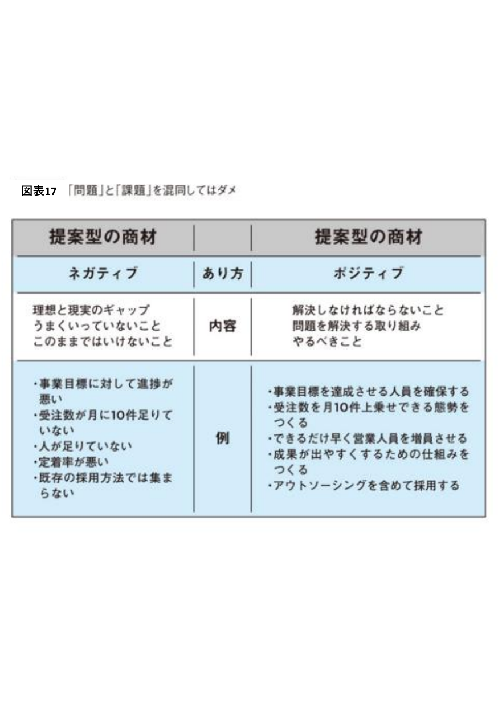
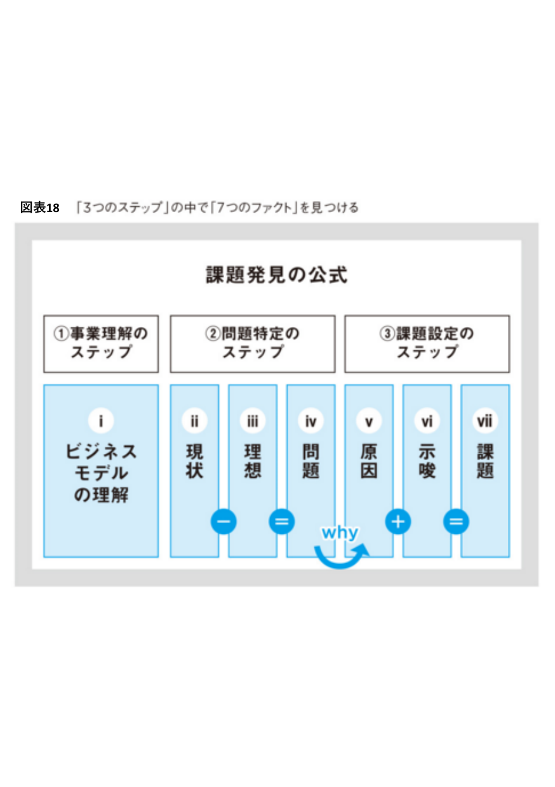
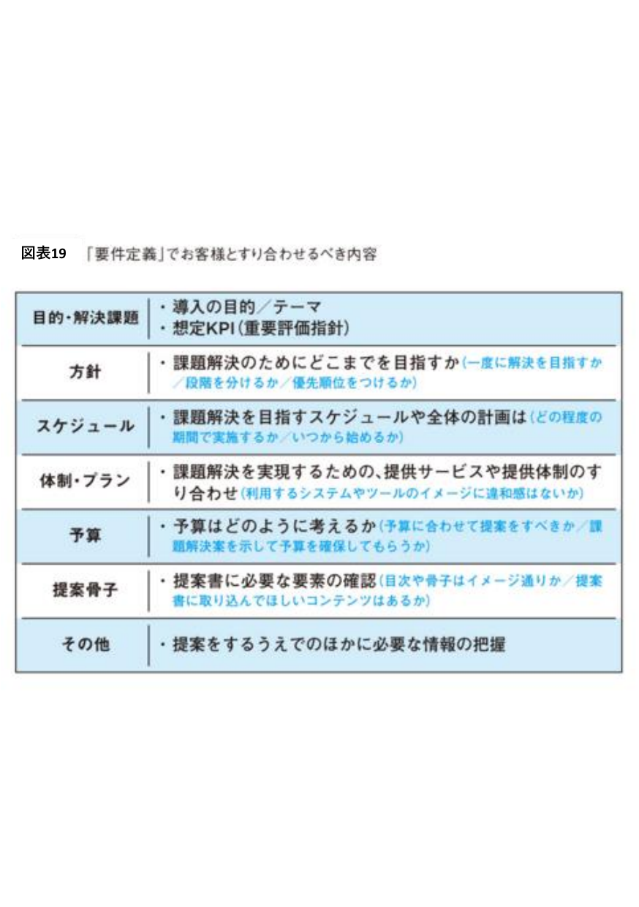
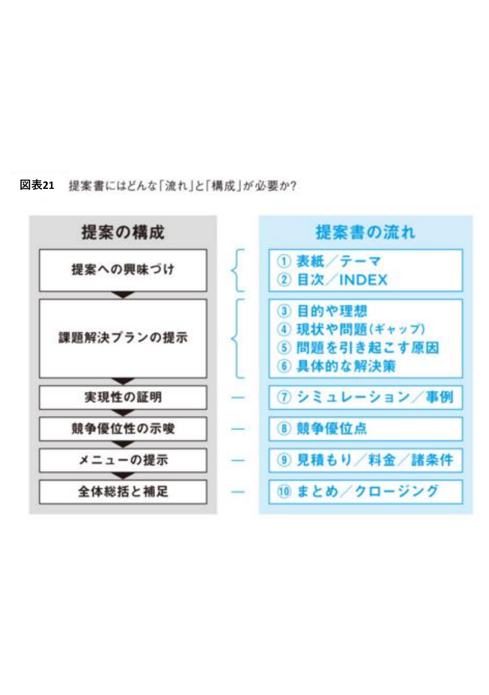

# スキル：提案書・ROI試算書設計

**使用するエージェント：** sales-enablement-executor / abm-strategist
**入力：** アカウント分析レポート（account-intelligence-analyst）・ステークホルダーマップ（stakeholder-mapper）・自社ソリューション情報
**出力：** 提案書・エグゼクティブサマリー・ROI試算書・RFP回答書・社内提案テンプレート

---

## 設計の原則

1. **顧客固有の情報を必ず盛り込む**：テンプレートのままでは使わない。アカウント名・課題・数値を入れる
2. **ステークホルダー別に設計する**：経営層向け・技術者向け・財務向けで内容と分量を変える
3. **ROI・数値を中心に据える**：toBは感情よりも数値・根拠で意思決定する
4. **読み手の時間を尊重する**：経営層は1〜2ページ・技術者は詳細仕様・担当者は操作性を優先
5. **保守的シナリオを併記する**：期待値だけでなく保守的な数値も示し、信頼性を担保する
6. **機能・特長ではなく「価値」を語る**：同じ商品でも訴求すべき価値は顧客によって異なる（詳細は`_shared/skills/consulting-sales-process.md`前提部分を参照）


上のオフィスチェアの例のように、「安全な品質」「デザイン賞受賞」といった機能・特長の羅列だけでは響かない。
その顧客にとっての価値（生産性向上か、オフィスの高級感か）を見極めてから提案書を書き始める。

---

## STEP 0：課題発見（提案の土台を固める）

提案書を書き始める前に、そもそも「何を解決する提案なのか」を正しく定義する。
ここが曖昧なまま8ステップ構成に進むと、顧客の心に刺さらない提案書になる。

### 「問題」と「課題」を混同しない



| | 問題（ネガティブ） | 課題（ポジティブ） |
|---|---|---|
| **内容** | 理想と現実のギャップ／うまくいっていないこと／このままではいけないこと | 解決しなければならないこと／問題を解決する取り組み／やるべきこと |
| **例** | 事業目標に対して進捗が悪い／受注数が月に10件足りていない／人が足りていない | 事業目標を達成させる人員を確保する／受注数を月10件上乗せできる態勢をつくる／できるだけ早く営業人員を増員させる |

提案書のエグゼクティブサマリー・現状の課題セクションは、**「問題」の指摘で終わらせず、必ず「課題（やるべきこと）」まで変換して記述する。**
問題の指摘だけでは顧客に「詰められている」印象を与え、課題（前向きな取り組み）に変換することで「一緒に解決する」提案になる。

### 課題発見の公式（7つのファクトを見つける）



```
①事業理解のステップ
  i. ビジネスモデルの理解

②問題特定のステップ
  ii. 現状（－）
  iii. 理想（＝）
  iv. 問題（現状と理想のギャップ）

③課題設定のステップ
  v. 原因（why：なぜその問題が起きているか）
  vi. 示唆（＋：原因を踏まえてどうすべきか）
  vii. 課題（＝：示唆を踏まえた「やるべきこと」）
```

**手順：**
1. i：顧客のビジネスモデルを理解する（account-intelligence-analystレポートを参照）
2. ii〜iv：現状（ii）と理想（iii）のギャップから「問題」（iv）を特定する
3. v：なぜその問題が起きているのか、「why」を問いかけて原因を掘り下げる
4. vi〜vii：原因（v）に対する示唆（vi）を加え、最終的な「課題」（vii）として言語化する

この7つのファクトが埋まって初めて、STEP2の8ステップ構成（特に「現状の課題」「解決策」）に着手する。

---

## STEP 1：ステークホルダー別の設計原則

提案書を作る前に「誰に読ませるか」を確定し、以下の原則に従って構成・分量を決める。

### 経営層（CEO/役員）向け
```
原則：結論を最初に・1〜2ページ以内・数値で語る
構成：現状の課題（数値）→ 解決策 → 投資対効果（ROI・回収期間）→ リスク低減策
避けること：機能一覧・技術詳細・長い本文
```

### 財務部長向け
```
原則：コスト・ROI・リスクの3点に集中する
構成：総所有コスト（TCO）比較 → ROI試算（保守的・期待値の2パターン）→ 予算執行プラン
避けること：機能説明・感情的訴求
```

### IT部長/CTO向け
```
原則：技術的な信頼性・統合・セキュリティを証明する
構成：アーキテクチャ概要 → セキュリティ要件対応表 → API仕様・統合方法 → SLA・サポート体制
避けること：ビジネス価値のみの訴求・ROI中心の話
```

### 現場マネージャー向け
```
原則：チームへの影響・導入負荷・業務効率化を具体的に示す
構成：現場課題への共感 → 具体的な業務改善例 → 導入・移行の負荷感 → サポート体制
避けること：経営的な数値・技術仕様
```

---

## STEP 2：提案書の8ステップ構成

```
1. エグゼクティブサマリー（1ページ：結論先行）
2. 課題の定義（顧客固有の課題・数値化された損失）
3. 解決策の提示（自社ソリューションの具体的な対応）
4. 導入事例・実績（同業他社の成功事例・数値）
5. ROI・投資対効果（保守的シナリオと期待値シナリオ）
6. 導入計画（フェーズ・スケジュール・マイルストーン）
7. リスク低減策（懸念点への対処・保証）
8. 次のステップ（明確なCTA）
```

各セクションには必ず、stakeholder-mapperから引き継いだ「対象ステークホルダーの懸念点」を1つ以上反映させる。

### 提案書作成前に顧客とすり合わせるべき「要件定義」

提案書を作り込む前に、以下をチャンピオン（推進者）と事前にすり合わせる。
これは`consulting-sales-process.md`の**④オーダーコントロール**工程（企画作成前の方向性合意）に相当する。



```markdown
## 要件定義すり合わせシート

- 目的・解決課題：導入の目的／テーマ・想定KPI（重要評価指標）
- 方針：課題解決のためにどこまでを目指すか（一度に解決／段階を分ける／優先順位をつける）
- スケジュール：課題解決を目指すスケジュールや全体の計画（期間・開始時期）
- 体制・プラン：提供サービスや提供体制のすり合わせ（システム/ツールのイメージに違和感はないか）
- 予算：予算はどのように考えるか（予算に合わせて提案／課題解決案を示して予算を確保してもらう）
- 提案骨子：提案書に必要な要素の確認（目次・骨子はイメージ通りか／取り込んでほしいコンテンツはあるか）
- その他：提案をするうえでのほかに必要な情報の把握
```

**このすり合わせを飛ばして提案書を作り込むと、STEP2の8ステップが顧客の期待とズレて手戻りが発生する。**

### 提案の構成と流れの対応関係

8ステップ構成は、より抽象化すると「提案への興味づけ→課題解決プランの提示→実現性の証明→競争優位性の示唆→メニューの提示→全体総括と補足」という6段階の「型」に沿っている。



| 提案の構成（型） | 提案書の流れ（8ステップとの対応） |
|--------------|---------------------------|
| 提案への興味づけ | ①表紙／テーマ、②目次／INDEX |
| 課題解決プランの提示 | ③目的や理想、④現状や問題（ギャップ）、⑤問題を引き起こす原因、⑥具体的な解決策 |
| 実現性の証明 | ⑦シミュレーション／事例 |
| 競争優位性の示唆 | ⑧競争優位点 |
| メニューの提示 | ⑨見積もり／料金／諸条件 |
| 全体総括と補足 | ⑩まとめ／クロージング |

STEP0で見つけた「7つのファクト」（現状・理想・問題・原因・示唆・課題）は、この「④現状や問題」「⑤問題を引き起こす原因」「⑥具体的な解決策」にそのまま対応する。

---

## STEP 3：ROI試算書の生成手順

```
1. 現状の損失コスト（問題が起きる頻度 × 1回あたりの損失）
2. 機会損失（理想の売上 − 現状の売上）
3. 導入コスト（初期費用・ランニングコスト・工数）
4. 削減効果（時間削減 × 時給換算・コスト削減・売上増加）
5. 回収期間（導入コスト ÷ 月次削減効果）
6. 3年間のROI計算（保守的シナリオ・期待値シナリオの2パターン）
```

### ROI試算フォーマット

```markdown
## ROI試算：[アカウント名]

### 現状の損失
- 問題発生頻度：　　回/月
- 1回あたりの損失：　　円
- 月間損失合計：　　円

### 導入コスト
- 初期費用：　　円
- 月額ランニングコスト：　　円
- 導入工数（人件費換算）：　　円

### 削減・増加効果
| 項目 | 保守的シナリオ | 期待値シナリオ |
|-----|------------|------------|
| 時間削減効果 | | |
| コスト削減効果 | | |
| 売上増加効果 | | |
| **月間合計効果** | | |

### 回収期間・ROI
| | 保守的シナリオ | 期待値シナリオ |
|--|------------|------------|
| 回収期間 | 　　ヶ月 | 　　ヶ月 |
| 1年目ROI | 　　% | 　　% |
| 3年間累計ROI | 　　% | 　　% |
```

---

## STEP 4：RFP回答書の作成方針

```markdown
## RFP回答チェックリスト

- [ ] RFPの要件項目を1つずつ機械的に転記し、対応可否（対応/一部対応/非対応）を明記したか
- [ ] 非対応・一部対応の項目には代替案または今後のロードマップを記載したか
- [ ] 要件外でも自社の強みとなる情報を「付加価値」として別セクションに追加したか
- [ ] 提出期限・フォーマット（ページ数・添付形式）を遵守しているか
- [ ] 競合が誇張しやすい項目（実績数・導入社数）は根拠となるデータを併記したか
```

---

## STEP 5：チャンピオン向け社内提案テンプレートの生成

チャンピオンが社内（上司・経営層）を説得するために使う資料。営業担当者向けではなく **チャンピオン自身が使うこと** を前提に作成する。

```markdown
## 社内提案テンプレート：[アカウント名]

【背景】チャンピオンの言葉で語れる課題認識（一人称で書けるように）
【現状の損失】数値化された損失（月次・年次）
【解決策】導入することで何がどう変わるか（Before → After）
【投資対効果】ROI試算の要約（保守的シナリオを中心に）
【他社事例】同業種・同規模の成功事例1〜2件
【次のアクション】社内承認を得るために必要な手続き・スケジュール
```

---

## アウトプットフォーマット（提案書本体）

```markdown
# 提案書：[アカウント名]

## エグゼクティブサマリー
（結論・投資対効果・次のステップを3〜5行で）

## 現状の課題
（顧客固有の課題・数値化された損失）

## 解決策
（自社ソリューションの具体的な対応）

## 導入事例・実績
（同業他社の成功事例・数値）

## 投資対効果（ROI）
（STEP3のROI試算を挿入）

## 導入計画
| フェーズ | 内容 | 期間 |
|--------|------|-----|

## リスク低減策
（懸念点ごとの対処・保証内容）

## 次のステップ
（明確なCTA・期日）
```

## 品質チェックリスト

- [ ] 「問題」の指摘で終わらせず「課題（やるべきこと）」まで変換して記述しているか
- [ ] 7つのファクト（現状・理想・問題・原因・示唆・課題）が埋まっているか
- [ ] 提案書を作り込む前に要件定義のすり合わせ（オーダーコントロール）を実施したか
- [ ] 対象ステークホルダーの役職に合わせた分量・言語になっているか
- [ ] 顧客固有の数値（課題・損失・ROI）が入っているか（テンプレートのままでないか）
- [ ] 保守的シナリオと期待値シナリオの両方が示されているか
- [ ] 回収期間が明記されているか
- [ ] 同業他社の事例が数値付きで記載されているか
- [ ] 次のアクション（CTA）が明確か
