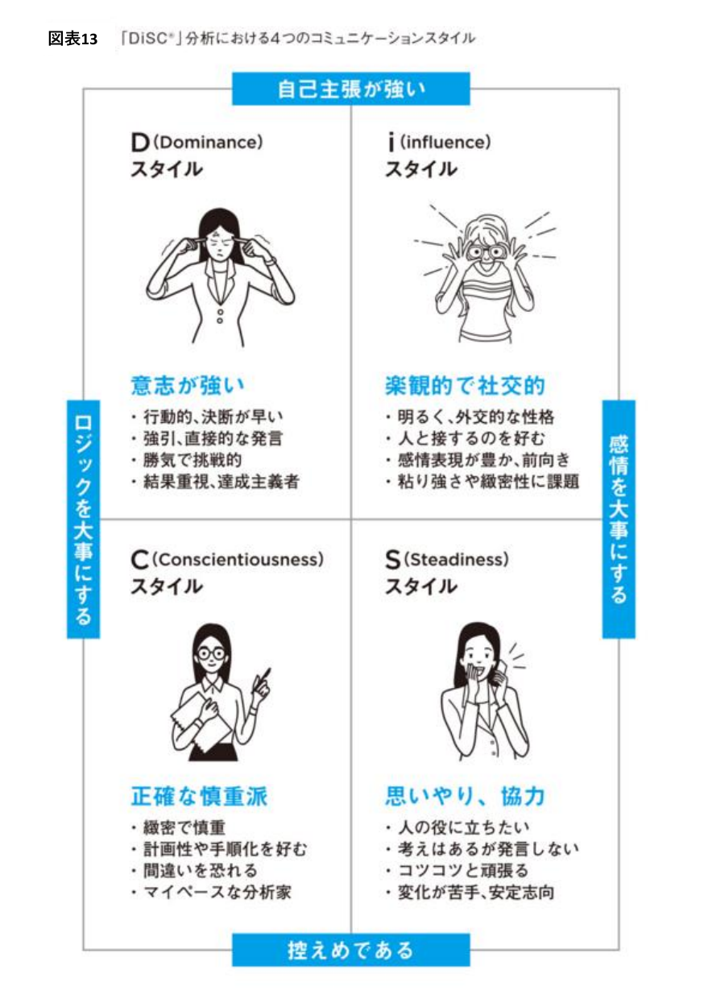
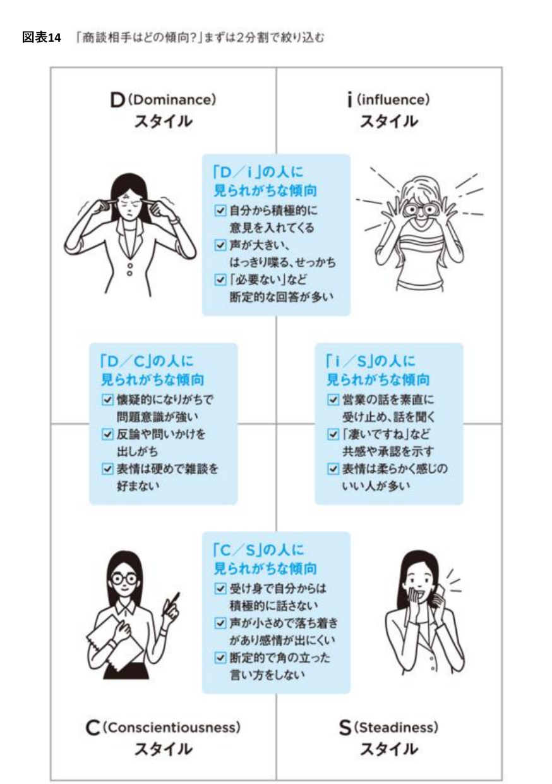
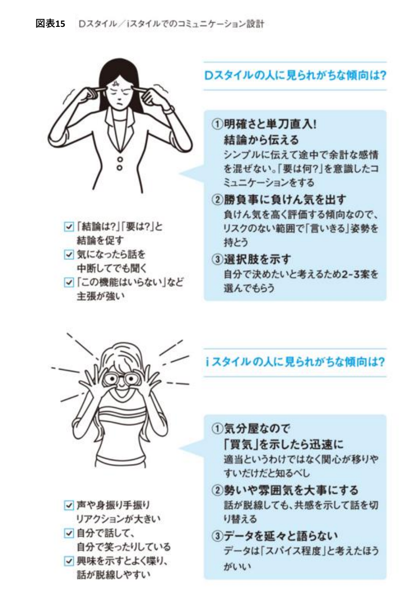
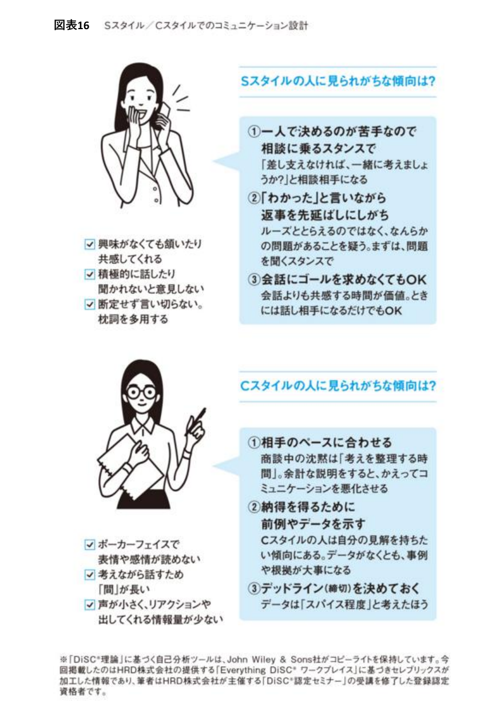
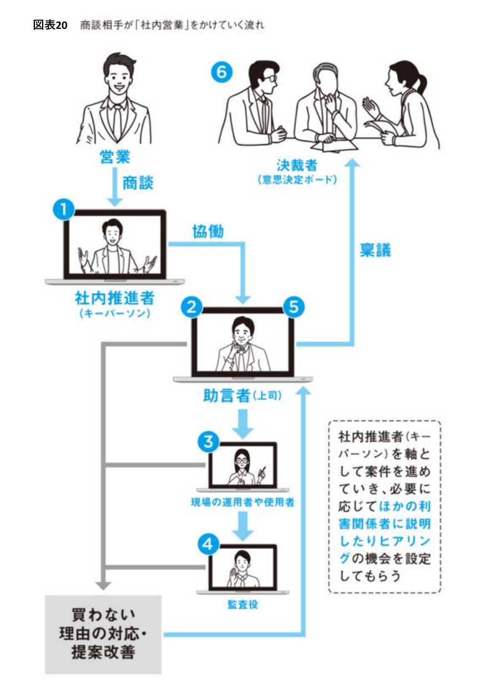
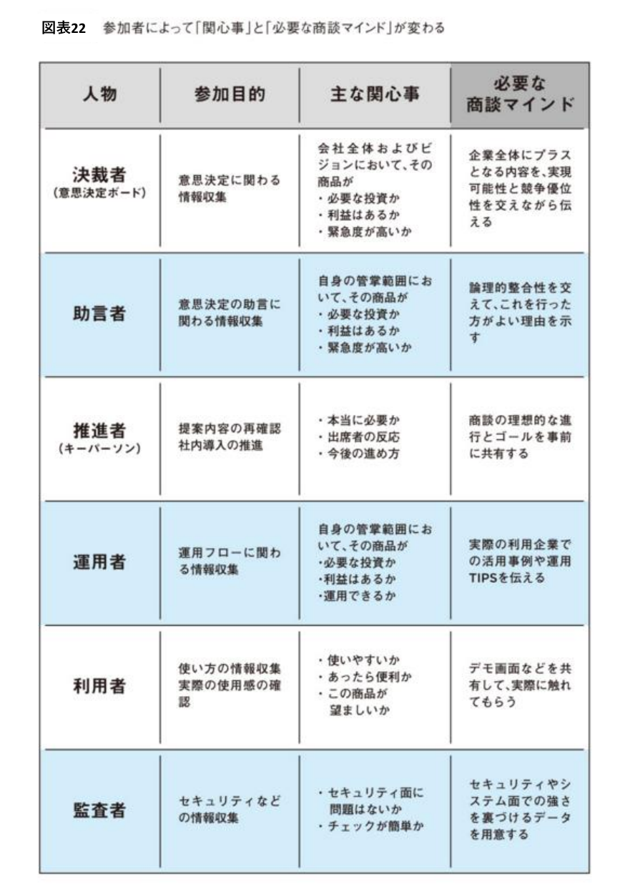

# スキル：ステークホルダー分析

**使用するエージェント：** stakeholder-mapper / abm-strategist
**入力：** ターゲットアカウント情報・組織情報・接触履歴
**出力：** ステークホルダーマップ・パワーマップ・エンゲージメント戦略

---

## ステークホルダーの5分類と訴求設計

### STEP 1：ステークホルダーの特定と分類

| 役割 | 英語略称 | 定義 | 優先度 |
|-----|---------|------|-------|
| 経済的意思決定者 | EDM | 最終的な予算承認権を持つ | 最高 |
| 技術的評価者 | TV | 製品の技術適合性を評価する | 高 |
| 影響者 | Inf | 意見が意思決定に影響する | 中〜高 |
| エンドユーザー | EU | 実際に製品を使う人 | 中 |
| チャンピオン | Champ | 社内で推進してくれる人 | 最高（育成対象） |
| ブロッカー | Block | 意思決定を阻む可能性のある人 | 対処が必要 |

### STEP 2：各ステークホルダーの情報整理

```markdown
## ステークホルダープロファイル

### 基本情報
- 氏名：
- 役職・職位：
- 所属部門：
- 在職年数（推定）：
- LinkedIn URL：

### 役割分類
- 主要役割：EDM / TV / Inf / EU / Champ / Block
- 意思決定への影響力：★★★ / ★★ / ★
- チャンピオン可能性：高 / 中 / 低

### 個人の優先目標
（この役職の人が最も重視していること・評価されていること）

### 課題・ペイン
（この役職の人が日常的に感じている困りごと）

### 懸念点・ブロッカー要因
（導入を躊躇させる可能性のある要因）

### 訴求メッセージの方向性
（この人に最も響くメッセージとコンテンツ）

### アクセス方法
- 共通コネクション：
- アプローチチャネル：LinkedIn / メール / 展示会 / 紹介
- 現在の関係深度：未接触→認知→興味→検討→推進
```

---

## DiSC分析：性格タイプ別のコミュニケーション設計

役割分類（EDM/TV/Influencer/EU/Champ/Blocker）が「誰が何を決めるか」を分類するのに対し、
DiSC分析は「**その人にどう話せば伝わるか**」を分類する。両方を組み合わせることで訴求メッセージの精度が上がる。

### STEP 2.5：4つのコミュニケーションスタイル



縦軸「ロジックを大事にする⇔感情を大事にする」×横軸「自己主張が強い⇔控えめである」の4象限で分類する。

| スタイル | 特徴 | 傾向 |
|---------|------|------|
| **D（Dominance）** | 意志が強い | 行動的・決断が早い／強引・直接的な発言／勝気で挑戦的／結果重視・達成主義者 |
| **i（influence）** | 楽観的で社交的 | 明るく外交的／人と接するのを好む／感情表現が豊か・前向き／粘り強さや緻密性に課題 |
| **C（Conscientiousness）** | 正確な慎重派 | 緻密で慎重／計画性や手順化を好む／間違いを恐れる／マイペースな分析家 |
| **S（Steadiness）** | 思いやり・協力 | 人の役に立ちたい／考えはあるが発言しない／コツコツ頑張る／変化が苦手・安定志向 |

### STEP 2.6：商談相手のスタイルを2分割で絞り込む



初回商談での言動から、まず対角線上の2タイプに絞り込むと判定しやすい。

| 組み合わせ | 見られがちな傾向 |
|---------|--------------|
| **D/i**（自己主張が強い） | 自分から積極的に意見を入れてくる／声が大きく断定的な回答が多い |
| **D/C**（ロジック重視） | 懐疑的で問題意識が強い／反論や問いかけを出しがち／表情は硬めで雑談を好まない |
| **i/S**（感情重視） | 話を素直に受け止める／「凄いですね」など共感や承認を示す／表情が柔らかい |
| **C/S**（控えめ） | 受け身で自分から積極的に話さない／声が小さめで落ち着きがある／断定的な言い方をしない |

### STEP 2.7：スタイル別コミュニケーション設計




```markdown
## Dスタイルへの対処
① 明確さと単刀直入！結論から伝える（「要は何？」を意識する）
② 勝負事に負けん気を出す（リスクのない範囲で「言いきる」姿勢）
③ 選択肢を示す（自分で決めたいので2〜3案を用意）

## iスタイルへの対処
① 気分屋なので「買気」を示したら迅速に動く（適当ではなく関心が移りやすいだけ）
② 勢いや雰囲気を大事にする（話が脱線しても共感を示して切り替える）
③ データを延々と語らない（データは「スパイス程度」）

## Sスタイルへの対処
① 一人で決めるのが苦手なので相談に乗るスタンスで（「一緒に考えましょうか？」）
② 「わかった」と言いながら返事を先延ばしにしがち（問題があることを疑い、まず聞くスタンスで）
③ 会話にゴールを求めなくてもOK（共感する時間が価値）

## Cスタイルへの対処
① 相手のペースに合わせる（商談中の沈黙は「考えを整理する時間」）
② 納得を得るために前例やデータを示す（事例や根拠が大事）
③ デッドライン（締切）を決めておく
```

**出典注記：**「DiSC®理論」に基づく自己分析ツールはJohn Wiley & Sons社がコピーライトを保持。
本スキルの内容はHRD株式会社提供「Everything DiSC® ワークプレイス」に基づく情報を参考に構成している。
実際の商談でDiSC診断結果（本人の自己申告）が得られる場合はそちらを優先し、得られない場合は上記の観察による推定を用いる。

---

## パワーマップの作成

### STEP 3：4象限への配置

```
意思決定への影響力（縦軸）× 自社への支持度（横軸）

        高影響力
           ↑
　　  [★育成] [★★★最優先]
高反対 ←──────────────→ 高支持
     [無視] [★情報提供]
           ↓
        低影響力

【最優先】高影響力 × 高支持 = 最優先エンゲージメント対象。チャンピオン候補
【育成】高影響力 × 低支持 = ブロッカーへの転換リスク。懸念解消が急務
【情報提供】低影響力 × 高支持 = 内部推薦者として活用。コンテンツ提供で育てる
【無視】低影響力 × 低支持 = 最低限の情報提供のみ
```

---

## チャンピオン育成の手順

### STEP 4：チャンピオン候補の選定基準

```markdown
チャンピオン候補の条件（3つ以上当てはまる人を選定）：
□ 現状の課題に対して強い問題意識を持っている
□ 自社製品の価値を理解・共感している
□ 社内での人間関係が良好（影響力がある）
□ 変化を好む・新しいツールの採用に積極的
□ この導入が成功すると自分のキャリアに プラスになる
```

### STEP 5：チャンピオン育成ステップ

```
Stage 1：認知
  → 課題に関連するコンテンツを継続提供
  → 業界情報・成功事例の共有

Stage 2：共感
  → 「あなたの課題を理解している」を示す
  → 個別の課題に対応したコンテンツ提供

Stage 3：信頼
  → 小さな価値提供の積み重ね（無料情報・特別アクセス）
  → コミュニティ・ユーザー会への招待

Stage 4：社内推進
  → 社内提案用の素材提供（ROI計算書・成功事例・経営層向けサマリー）
  → 社内での説得に役立つデータ・資料を渡す

Stage 5：成約・定着
  → 成約後も継続的な成功支援
  → 次の案件でのリファレンス依頼
```

---

## ブロッカー対処の手順

### STEP 6：ブロッカーの懸念タイプと対処法

| 懸念タイプ | 主な発言例 | 対処コンテンツ |
|---------|---------|------------|
| **予算競合** | 「今年の予算は別プロジェクトで使う」 | ROI試算で機会損失を数値化・来年度予算への組み込み提案 |
| **セキュリティ** | 「セキュリティ審査が通るか心配」 | セキュリティ認証資料・ペネトレーションテスト結果・NDAの迅速対応 |
| **既存ベンダー関係** | 「今のベンダーで間に合っている」 | 競合比較表・スイッチングコストを上回るROI試算 |
| **変化への抵抗** | 「今は変化のタイミングではない」 | 現状維持のリスク・損失の数値化（プロスペクト理論の活用） |
| **導入負荷** | 「導入の手間が心配」 | 段階的導入プラン・手厚いオンボーディング実績・移行支援体制 |
| **実績不足** | 「実績がまだ少ない」 | 同業種・同規模の成功事例・リファレンスコールの提案 |

---

## 社内購買委員会の力学（商談相手が行う「社内営業」の理解）

チャンピオンは商談後、社内で自ら「営業活動」を行い、稟議を通していく。この流れを理解しないと、
チャンピオンに丸投げした資料が社内で使われず失注する。

### STEP 7：社内で稟議が通る流れ



```
自社の営業 → 商談 → 社内推進者（キーパーソン）
                         ↓ 協働
                     助言者（上司）
                    ↓         ↓
          現場の運用者/使用者   （上申）
                    ↓
                  監査役
                         ↓ 稟議
                    決裁者（意思決定ボード）
```

社内推進者（キーパーソン）を軸として案件が進み、必要に応じて他の利害関係者への説明・ヒアリングの機会が設定される。
**買わない理由が生まれるポイントは、この各ステップのどこかで説明・納得が不足したとき。**

### STEP 8：参加者別の関心事と必要な商談マインド



| 人物 | 参加目的 | 主な関心事 | 必要な商談マインド |
|-----|--------|---------|---------------|
| **決裁者**（意思決定ボード） | 意思決定に関わる情報収集 | 会社全体・ビジョンにおいて必要な投資か／利益はあるか／緊急度が高いか | 企業全体にプラスとなる内容を、実現可能性と競争優位性を交えて伝える |
| **助言者** | 意思決定の助言に関わる情報収集 | 自身の管掌範囲で必要な投資か・利益はあるか・緊急度が高いか | 論理的整合性を交えて、行った方がよい理由を示す |
| **推進者**（キーパーソン） | 提案内容の再確認・社内導入の推進 | 本当に必要か／出席者の反応／今後の進め方 | 商談の理想的な進行とゴールを事前に共有する |
| **運用者** | 運用フローに関わる情報収集 | 自身の管掌範囲で必要な投資か・利益はあるか・運用できるか | 実際の利用企業での活用事例や運用TIPSを伝える |
| **利用者** | 使い方の情報収集・使用感の確認 | 使いやすいか／あったら便利か／この商品が望ましいか | デモ画面などを共有し、実際に触れてもらう |
| **監査者** | セキュリティなどの情報収集 | セキュリティ面に問題はないか／チェックが簡単か | セキュリティやシステム面での強さを裏づけるデータを用意する |

**このスキルの既存5分類との対応関係：**

| 本セクションの役割 | 既存の5分類（EDM/TV/Influencer/EU/Champ/Blocker）との対応 |
|--------------|-------------------------------------------------|
| 決裁者 | EDM（経済的意思決定者） |
| 助言者 | TV（技術的評価者）またはInfluencer |
| 推進者（キーパーソン） | Champ（チャンピオン） |
| 運用者・利用者 | EU（エンドユーザー） |
| 監査者 | TV（技術的評価者）の一種、またはBlockerになりうる |

**実務上の使い分け：** 5分類は「初期のステークホルダーマッピング」に、本セクション（決裁者〜監査者）は
「商談が進んだ後、社内でどう稟議が回っていくかの詳細設計」に使う。チャンピオンに渡す社内提案素材
（`_shared/skills/proposal-writing.md` STEP5）は、この6役割それぞれの関心事に応える内容を含める。

---

## アウトプット：ステークホルダー分析サマリー

```markdown
# ステークホルダー分析：[企業名]

## ステークホルダー一覧

| 氏名 | 役職 | 分類 | DiSCスタイル | 社内購買委員会ロール | 影響力 | 支持度 | 関係深度 |
|-----|------|-----|-----------|--------------|-------|-------|-------|

## パワーマップ（テキスト版）
- 最優先エンゲージメント対象：
- チャンピオン候補：
- ブロッカーと懸念タイプ：

## DiSCスタイル別の訴求メッセージ
| 氏名 | スタイル | コミュニケーション設計上の注意点 |
|-----|--------|--------------------------|

## 社内稟議フローの見立て
- 推進者（キーパーソン）：
- 助言者（上司）：
- 運用者/利用者：
- 監査者：
- 決裁者（意思決定ボード）：
- 想定される稟議上のボトルネック：

## チャンピオン育成計画
| チャンピオン候補 | 現在のStage | 次のアクション | 期日 |
|--------------|-----------|------------|-----|

## ブロッカー対処計画
| ブロッカー | 懸念タイプ | 対処コンテンツ | 期日 |
|---------|---------|------------|-----|

## エンゲージメントロードマップ（90日）
| 時期 | ターゲット | アクション | ゴール |
|-----|---------|--------|------|
```
